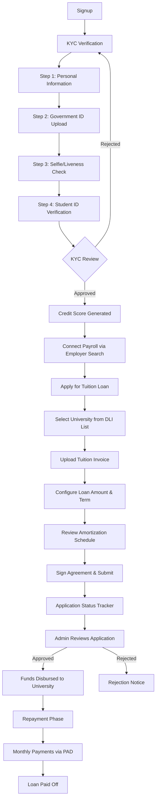
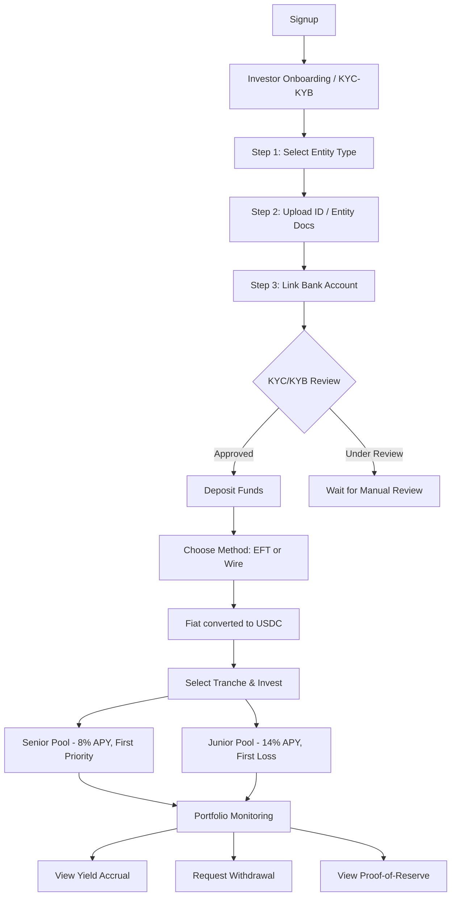
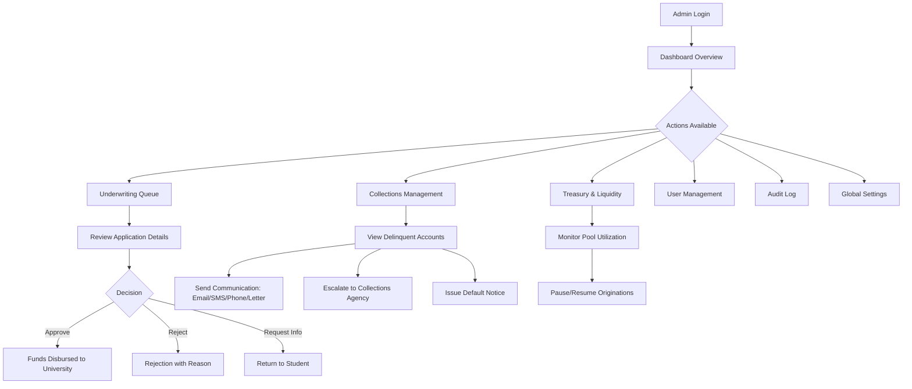
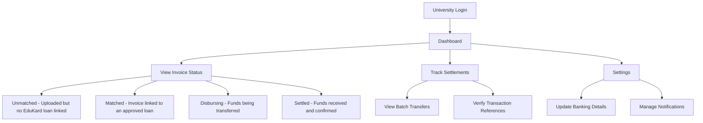
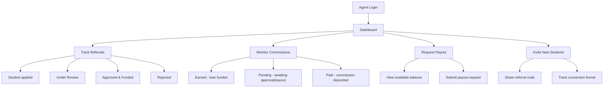

# EduKard Platform — Complete User Flow & Functionality Documentation

> **Version:** 1.0  
> **Last Updated:** April 7, 2026  
> **Platform:** EduKard RWA Tuition Finance Protocol  
> **Architecture:** Next.js 14 (App Router) + RBAC Dashboard System  
> **Status:** UI/UX Complete · Backend Integration Pending

---

## Table of Contents

1. [Platform Overview](#1-platform-overview)
2. [User Type: Student (Borrower)](#2-student-borrower-portal)
3. [User Type: Investor (Capital Provider)](#3-investor-capital-provider-portal)
4. [User Type: Admin (Protocol Operator)](#4-admin-protocol-operator-portal)
5. [User Type: University (Institution Partner)](#5-university-institution-partner-portal)
6. [User Type: Agent (Referral Partner)](#6-agent-referral-partner-portal)
7. [Cross-Portal Interactions](#7-cross-portal-interactions)
8. [User Onboarding Matrix](#8-user-onboarding-matrix)
9. [Missing Backend Flows & Integration Gaps](#9-missing-backend-flows--integration-gaps)

---

## 1. Platform Overview

EduKard is a DeFi-powered Real-World Asset (RWA) protocol that provides uncollateralized, near-instant tuition bridge financing for employed international students in Canada. It connects **5 user types** in a circular ecosystem:

```
   ┌─────────────┐
   │   INVESTOR   │ ── deposits fiat → converted to USDC
   └─────┬───────┘
         │ capital flows into
         ▼
   ┌─────────────┐
   │  LIQUIDITY   │ ── Senior Pool (8% APY) + Junior Pool (14% APY)
   │    POOLS     │
   └─────┬───────┘
         │ funds deployed via
         ▼
   ┌─────────────┐        ┌─────────────┐
   │    ADMIN     │───────▶│   STUDENT    │ ── applies for loan
   │ (underwrite) │        └──────┬──────┘
   └─────────────┘               │ funds sent directly to
                                 ▼
                          ┌─────────────┐
                          │  UNIVERSITY  │ ── receives tuition settlement
                          └─────────────┘
                                 ▲
   ┌─────────────┐               │
   │    AGENT     │───────────────┘ ── refers students, earns commission
   └─────────────┘
```

### How Does Each User Get Added?

| User Type | Current Onboarding Method | Production Requirement |
|:---|:---|:---|
| **Student** | Self-signup via `/signup?role=student` | Supabase Auth + Sumsub KYC verification |
| **Investor** | Self-signup via `/signup?role=investor` | Supabase Auth + NI 45-106 accreditation check |
| **Admin** | No signup flow — login with "admin" keyword in email | Manually provisioned by superadmin in Supabase |
| **University** | No signup flow — login with "university" keyword in email | Onboarded via admin-initiated partnership agreement |
| **Agent** | No signup flow — login with "agent" keyword in email | Onboarded via admin-initiated partner contract |

### Current Auth Mechanism

The login system (`/login`) uses **client-side keyword detection** in the email to route users:

```
email contains "admin"      → /admin/dashboard
email contains "investor"   → /investor/dashboard
email contains "university" → /university/dashboard
email contains "agent"      → /agent/dashboard
default (anything else)     → /student/dashboard
```

> ⚠️ **Production Gap:** There is no real authentication. No session persistence, no password verification, no JWT/cookie-based auth. This requires Supabase Auth integration.

---

## 2. Student (Borrower) Portal

**Access:** `/student/*` (10 pages)  
**Theme:** Emerald Green (`#10B981`)  
**User:** Employed international student in Canada seeking tuition financing

### 2.1 How Does a Student Join?

```
Landing Page (/):
  └── "Apply Now" CTA or "Student" portal card
       └── /signup?role=student
            ├── Name, Email, Password
            ├── PIPEDA consent checkbox
            └── Submit → Redirect to /student/dashboard
```

**What exists:** Basic signup form with name, email, password, and consent.  
**What's missing:** Email verification, Supabase Auth session, wallet generation (Account Abstraction for on-chain), and redirect to KYC instead of dashboard.

### 2.2 Complete Student Journey



### 2.3 Page-by-Page Functionality

#### `/student/dashboard` — Home
| Feature | Description | Status |
|:---|:---|:---|
| Welcome Banner | Personalized greeting with student name | ✅ Static |
| Stats Grid | Total Borrowed, Total Paid, Remaining Balance, Next Payment | ✅ Mock data |
| Active Loan Card | University name, loan ID, APR, term, monthly payment, progress bar | ✅ |
| Payment Schedule Table | Amortized payments with paid/upcoming status | ✅ |
| "+ New Application" CTA | Links to `/student/apply` | ✅ |

#### `/student/onboarding` — KYC Verification (4-Step Wizard)
| Step | What It Does | Integration Needed |
|:---|:---|:---|
| **1. Personal Info** | First/last name, DOB, nationality, Canadian address | Supabase profiles table |
| **2. Government ID** | Upload front + back of passport/license (drag & drop zones) | Sumsub SDK / S3 storage |
| **3. Selfie Verification** | Camera preview with liveness circle overlay | Sumsub Liveness SDK |
| **4. Student Verification** | Upload Student ID + optional Study Permit | Sumsub / S3 storage |

**What happens after submission:** Shows "Under Review" status pill. In production, Sumsub webhook would update `kyc_status` from `pending` → `approved`.  
**What's missing:** Real file upload to S3/Sumsub, webhook listener for approval/rejection, notification to student.

#### `/student/credit-score` — EduKard Score
| Feature | Description |
|:---|:---|
| Score Gauge | Visual gauge showing EduKard Score (0-100, not FICO) |
| Score Breakdown | Monthly income, DTI ratio, employment months, approved limit |
| Risk Flag | Green/Yellow/Red badge |
| Scoring Factors | Weighted factors: income stability, DTI, employment duration, payroll consistency |

**How is the score generated?** Currently static from `MOCK_CREDIT_ASSESSMENT`. In production, the scoring engine would pull from Plaid/Argyle payroll data and calculate: `edukard_score = f(income_stability, DTI, employment_duration, payroll_consistency)`.

#### `/student/apply` — Loan Application (3-Step Wizard)
| Step | What the Student Does |
|:---|:---|
| **1. University & Invoice** | Search and select from 20+ Canadian DLI-registered universities. Enter student ID number. Upload official tuition invoice (PDF/JPG/PNG). |
| **2. Loan Details** | Adjust loan amount (slider, $1K–$18K based on approved limit). Select term (12/18/24/36 months). View full amortization schedule preview with Canadian cost-of-borrowing disclosure (APR, monthly, total interest, total cost). |
| **3. Review & Sign** | Review all details. Read legal disclosures (2-day cooling-off, PAD mandate, late fees). Consent checkbox. "Sign & Submit Application" button. |

**What happens after submission:** Redirects to `/student/application-status`. In production, creates a `loan_applications` row with status `submitted` and triggers admin notification.

#### `/student/application-status` — Timeline Tracker
5-step visual timeline showing application progress:
1. Application Submitted → 2. Under Review → 3. Approved → 4. Disbursing Funds → 5. Funds Disbursed to University

**What's missing:** Real-time status updates via Supabase Realtime subscriptions. Currently shows static mock data with all steps "completed".

#### `/student/payments` — Payment Management
| Feature | Description |
|:---|:---|
| Payment schedule table | All amortized payments with due date, principal, interest, balance |
| Status badges | ✓ Paid (green) / Upcoming (amber) |
| Payment history | Past payments with confirmation |

**What's missing:** "Make a Payment" action button, PAD enrollment flow, payment method management, early payoff calculator.

#### `/student/payroll` — Employment & Income
| Feature | Description |
|:---|:---|
| Employer search | Search 8+ mock employers (Tim Hortons, Walmart, CIBC, etc.) |
| Connection status | Connected/disconnected badges |
| Payslip history | 6 recent payslips with gross/net/deductions/hours |
| Income summary | Monthly income calculation from payroll data |

**What's missing:** Real Plaid/Argyle integration for payroll connection. Currently shows mock data.

#### `/student/documents` — Document Vault
| Feature | Description |
|:---|:---|
| Document list | Loan agreement, tuition invoice, KYC documents |
| Upload zone | Drag-and-drop file upload |
| Download links | View/download stored documents |

#### `/student/support` — Help & Support
| Feature | Description |
|:---|:---|
| FAQ accordion | Common questions about payments, interest, cancellation |
| Contact form | Name, email, subject, message fields |
| Emergency contacts | Phone and email support channels |

#### `/student/settings` — Account Settings
| Feature | Description |
|:---|:---|
| Profile form | Name, email, phone, address |
| Notification toggles | Email, SMS, payment reminders, marketing |
| Language preference | English/French selection |

---

## 3. Investor (Capital Provider) Portal

**Access:** `/investor/*` (7 pages)  
**Theme:** Teal (`#14B8A6`)  
**User:** Accredited investor (individual, corporation, fund, or trust) seeking RWA-backed yield

### 3.1 How Does an Investor Join?

```
Landing Page (/):
  └── "Start Investing" CTA or "Investor" portal card
       └── /signup?role=investor
            ├── Name, Email, Password
            ├── PIPEDA consent checkbox
            └── Submit → Redirect to /investor/dashboard
```

**What's missing:** Accredited investor verification flow, NI 45-106 attestation, Supabase Auth.

### 3.2 Complete Investor Journey



### 3.3 Page-by-Page Functionality

#### `/investor/onboarding` — KYC/KYB Verification
| Step | Individual | Corporation/Fund/Trust |
|:---|:---|:---|
| **1. Entity Type** | Select "Individual" | Select Corp, Fund, or Trust |
| **2. Documents** | Government ID + Proof of Accreditation | Certificate of Incorporation, Authorized Signatories, Board Resolution, Signatory ID |
| **3. Bank Link** | Connect via Plaid OR manual entry (Institution #, Transit #, Account #) | Same |
| **4. Review** | — (3 steps only for individuals) | "Under Review" status (1-3 business days) |

**Additional compliance:** Accredited investor attestation checkbox referencing NI 45-106 (Canada).

#### `/investor/deposit` — Fund Your Account
| Feature | Description |
|:---|:---|
| EFT Tab | Domestic CAD transfer, ~2-3 business days clearance |
| Wire Tab | Same-day for amounts >$50K, international supported |
| USDC conversion | Real-time fiat-to-USDC preview (1:1 peg assumed) |
| Deposit history | Past deposits with status badges (confirmed/processing) |

#### `/investor/invest` — Tranche Selection
| Tranche | Target APY | Risk Profile | Description |
|:---|:---|:---|:---|
| **Senior** | 8% | Lower risk, payment priority | First to receive repayments; protected by junior tranche |
| **Junior** | 14%+ | Higher risk, first-loss | Higher yield but absorbs defaults first |

**What's missing:** Investment amount input, split allocation slider, subscription commitment, cooling-off period.

#### `/investor/portfolio` — Holdings & Performance
| Feature | Description |
|:---|:---|
| Portfolio value chart | Line chart showing value over time |
| Allocation breakdown | Senior vs Junior split with amounts |
| Yield accrual | Total yield earned, weighted APY |
| Transaction history | Deposits, investments, yield payments |

#### `/investor/transparency` — Proof of Reserve
| Feature | Description |
|:---|:---|
| Reserve verification | Total pool capital vs deployed capital |
| Smart contract addresses | On-chain contract links (Ethereum/Base) |
| Audit reports | Compliance and financial audit documents |
| Loan performance | Aggregate default rates, collection efficiency |

---

## 4. Admin (Protocol Operator) Portal

**Access:** `/admin/*` (8 pages)  
**Theme:** Purple (`#8B5CF6`)  
**User:** Arkad operations team managing risk, liquidity, and compliance

### 4.1 How Does an Admin Join?

**There is NO self-signup for admins.** Admin accounts must be provisioned:

```
Production flow:
  1. Superadmin creates user in Supabase Auth console
  2. Superadmin assigns role: "admin" in profiles table
  3. New admin logs in via /login
  4. System recognizes admin role → routes to /admin/dashboard
```

**Current demo:** Any email containing "admin" routes to admin dashboard.  
**What's missing:** Supabase Auth, role-based session validation, admin invitation workflow.

### 4.2 Complete Admin Capabilities



### 4.3 Page-by-Page Functionality

#### `/admin/dashboard` — Operations Overview
| Metric | Description |
|:---|:---|
| Pending Applications | Count of apps awaiting review |
| Active Loans | Total loans currently being repaid |
| Total Disbursed | Aggregate capital deployed to universities |
| Default Rate | Current portfolio default percentage |
| Pool Utilization | % of total capital currently deployed |
| Total TVL | Total Value Locked across both pools |

#### `/admin/underwriting` — Application Review Queue
| Feature | Description |
|:---|:---|
| Risk-filtered list | Filter by All / 🟢 Low / 🟡 Medium / 🔴 High risk |
| Application cards | Applicant name, university, amount, term, APR, risk badge |
| Quick actions | ✓ Approve / ✕ Reject buttons directly on card |
| Deep review link | "Review Details →" navigates to full underwriting detail page |

#### `/admin/underwriting/[id]` — Underwriting Detail
This is the **most data-rich page** in the entire application. For each applicant, the admin sees:

| Section | Data Displayed |
|:---|:---|
| **Application Summary** | Amount, term, APR, university, submission date |
| **Applicant Profile** | Name, connected employer, position, employment duration |
| **EduKard Credit Assessment** | Score (0-100), monthly income, DTI ratio, approved limit, risk flag |
| **Payroll Verification** | Last 3 payslips with gross/net/deductions/hours |
| **Uploaded Documents** | List of Government ID, Student ID, invoice, study permit |
| **Decision Panel** | Approve (with notes) / Reject (with denial reason) buttons |

**Example denial reason (Red flag):** "Insufficient employment history (4 months, minimum 6 required). DTI ratio of 48.5% exceeds the 40% threshold."

#### `/admin/collections` — Delinquent Account Management
| Stage | Days Late | Actions Available |
|:---|:---|:---|
| **1-30 Late** | 1-30 days | Auto email reminder, SMS nudge |
| **31-60 Late** | 31-60 days | Manual phone call, payment arrangement |
| **61-90 Late** | 61-90 days | Formal collection notice, escalation |
| **Default** | 90+ days | Notice of Default, external collections referral |

Communication log tracking: Every email, SMS, phone call, and letter is logged with timestamp, sender, and delivery status.

#### `/admin/treasury` — Liquidity & Pool Management
| Feature | Description |
|:---|:---|
| Total TVL | $3,500,000 across both pools |
| Pool utilization gauges | Senior (85%) and Junior (78%) with color-coded bars |
| Available liquidity | Remaining capital available for new loans |
| Origination toggle | ACTIVE/PAUSED switch — when paused, no new loans are processed |

#### `/admin/users` — User Management
| Tab | Shows |
|:---|:---|
| Students | All registered students with KYC status, loan status |
| Investors | All registered investors with investment totals |

**What's missing:** Ability to add/edit/deactivate users, role assignment, KYC override.

#### `/admin/audit` — Immutable Action Log
| Tracked Actions |
|:---|
| Application approved/rejected (with reason and admin ID) |
| Funds disbursed (amount, university, date) |
| Collections communication sent |
| System configuration changes |

#### `/admin/settings` — Global Configuration
| Setting | Description |
|:---|:---|
| Max loan amount | Global cap on individual loans |
| APR configuration | Base rate and risk-adjusted spreads |
| Minimum employment months | Eligibility threshold |
| Max DTI ratio | Automatic rejection threshold |
| Pool allocation rules | Senior/junior split parameters |

---

## 5. University (Institution Partner) Portal

**Access:** `/university/*` (4 pages)  
**Theme:** Amber (`#F59E0B`)  
**User:** University bursar/registrar office receiving EduKard tuition settlements

### 5.1 How Does a University Join?

**Universities DO NOT self-register.** The onboarding is an **admin-initiated partnership process:**

```
Production flow:
  1. EduKard sales/partnerships team identifies a Canadian DLI university
  2. Partnership agreement signed (offline/DocuSign)
  3. Admin creates university profile in the system:
       - Institution name, DLI number, province, city
       - Settlement bank account details (transit, institution #, account #)
  4. University bursar receives login credentials
  5. University appears in the student loan application DLI search list
```

**Current state:** No admin-side "Add University" workflow exists. Universities are hardcoded in `lib/constants.ts` (20+ Canadian DLI institutions). The university portal login uses keyword detection ("university" or "bursar" in email).

**What's missing:**
- Admin panel → "Add Partner University" form
- University invitation email workflow
- DLI verification check
- Settlement account validation (EFT pre-note)
- University self-service password reset

### 5.2 University Capabilities



### 5.3 Page-by-Page Functionality

#### `/university/dashboard`
| Feature | Description |
|:---|:---|
| Stats | Total Students Funded (142), Total Disbursed YTD ($2.15M), Pending Invoices (45), Incoming Settlements (3) |
| Recent Invoices Table | Student name, program, amount, status (Settled/Matched/Unmatched) |
| Recent Settlements List | Batch amounts, student count, completion status |

#### `/university/invoices` — Invoice Management
| Invoice Status | Meaning |
|:---|:---|
| **Unmatched** | University uploaded invoice, but student hasn't applied for EduKard loan yet |
| **Matched** | Invoice linked to an approved EduKard loan application |
| **Disbursing** | Funds are being transferred from the liquidity pool |
| **Settled** | Funds received in university settlement account |

**What's missing:** Invoice upload by university (currently only student uploads invoice during loan application), invoice reconciliation flow, bulk upload.

#### `/university/settlements` — Payment Tracking
| Feature | Description |
|:---|:---|
| Settlement list | Batch transfers with date, amount, currency (CAD), student count |
| Transaction hash | On-chain reference for USDC→CAD conversion verification |
| Status tracking | Pending → Completed |

#### `/university/settings` — Institution Management
| Section | Features |
|:---|:---|
| Institution Profile | Name, DLI number, registrar email, phone, campus address, invoice prefix |
| Settlement Banking | Bank name, transit #, institution #, account # (encrypted) |
| Notification Preferences | Auto-reconcile invoices, email notifications, settlement alerts, monthly reports |
| Danger Zone | "Disconnect from EduKard" request |

---

## 6. Agent (Referral Partner) Portal

**Access:** `/agent/*` (4 pages)  
**Theme:** Pink (`#EC4899`)  
**User:** Education consultant, immigration agent, or recruitment partner who refers students to EduKard

### 6.1 How Does an Agent Join?

**Agents DO NOT self-register.** The onboarding is an **admin-initiated partner process:**

```
Production flow:
  1. Referral partner applies via website or is recruited by EduKard BD team
  2. Partner agreement signed (commission terms, territory, exclusivity)
  3. Admin creates agent profile in the system:
       - Company name, primary contact, email, territory
       - Commission rate (typically 10% per funded loan)
       - Payout banking details
       - Unique referral code (e.g., GEP-2026-DM)
  4. Agent receives login credentials and referral code
  5. Agent shares referral code/link with prospective students
```

**Current state:** No admin-side "Add Partner" workflow exists. Agent login uses keyword detection.  
**What's missing:** Admin panel → "Add Referral Partner" form, partner application/approval flow, referral code generation, tracking pixel/UTM link system.

### 6.2 Agent Capabilities



### 6.3 Page-by-Page Functionality

#### `/agent/dashboard`
| Feature | Description |
|:---|:---|
| Stats | Total Referrals (114), Active Loans (47), Total Commission ($47K), Pending Commission ($8.5K) |
| Recent Referrals Table | Student name, university, loan status, commission status |

#### `/agent/referrals` — Student Pipeline
| Feature | Description |
|:---|:---|
| Full referral table | Student name, referral date, target university, loan status, approved amount |
| "+ Invite Student" button | Triggers invitation flow (email/link share) |
| Status tracking | Under Review → Approved → Repaying, or Rejected |

**How does referral attribution work?**
Currently: Referrals are manually associated via mock data (`MOCK_AGENT_REFERRALS`).  
Production: Student signs up with agent's referral code (e.g., `?ref=GEP-2026-DM`), which is stored in the `loan_applications` table as `referral_agent_id` for commission tracking.

#### `/agent/commissions` — Earnings & Payouts
| Feature | Description |
|:---|:---|
| Summary stats | Total Earned ($3K), Available for Payout ($2K), Next Payout Date |
| Commission table | Per-student earnings with date, amount, status (Paid/Pending) |
| "Request Payout" button | Initiates payout of available balance to agent's bank |

**Commission calculation:** 10% of the loan principal upon successful disbursement. Commission is earned when loan status changes to `disbursed`. Payout is processed monthly or on-demand.

#### `/agent/settings` — Partner Management
| Section | Features |
|:---|:---|
| Partner Profile | Company name, contact person, email, phone, territory |
| Referral Code | Unique code with "Copy" button for sharing |
| Commission & Payout | Current commission rate (10%), payout method (EFT/Wire/Cheque), banking details |
| Notifications | Email alerts, SMS notifications, weekly digest, payout alerts |

---

## 7. Cross-Portal Interactions

This is the critical "how does it all connect" section:

### 7.1 Student applies → Admin reviews → University receives funds

```
1. STUDENT submits application at /student/apply
   └── Creates loan_applications row (status: "submitted")
   
2. ADMIN sees it in /admin/underwriting queue
   └── Clicks "Review Details" → sees full credit, payroll, documents
   └── Clicks "Approve" → status changes to "approved"
   
3. System initiates disbursement
   └── USDC from liquidity pool → converted to CAD → wire to university
   └── Application status: "approved" → "disbursing" → "disbursed"
   
4. UNIVERSITY sees settlement in /university/settlements
   └── Invoice status: "matched" → "disbursing" → "settled"
   
5. STUDENT sees timeline update at /student/application-status
   └── All 5 steps show "completed" ✓
   └── Repayment schedule becomes active
```

### 7.2 Agent refers student → Student applies → Agent earns commission

```
1. AGENT shares referral code (GEP-2026-DM) via /agent/referrals
   └── Student registers at /signup?ref=GEP-2026-DM
   
2. STUDENT completes KYC and applies for loan
   └── Application carries referral_agent_id
   
3. ADMIN approves application
   └── Loan disbursed to university
   
4. AGENT sees new entry in /agent/commissions
   └── commission_earned: $1,000 (10% of $10,000 loan)
   └── commission_status: "pending" → "paid" (on next payout cycle)
```

### 7.3 Investor deposits → Pool grows → Admin deploys → Student repays → Yield distributed

```
1. INVESTOR deposits $50,000 via /investor/deposit (EFT or Wire)
   └── Fiat → USDC conversion → deposited into Senior Pool
   
2. Pool utilization increases (visible at /admin/treasury)
   └── Senior Pool: $2.5M total, 85% utilized
   
3. ADMIN approves student loan
   └── Capital deployed from pool → utilization increases
   
4. STUDENT makes monthly payments ($726.84/month)
   └── Payments split: principal (back to pool) + interest (distributed as yield)
   
5. INVESTOR sees yield accrual at /investor/portfolio
   └── Accrued yield grows monthly based on payment inflows
   └── Portfolio value: $50,000 + $1,643.84 accrued yield
```

### 7.4 Student defaults → Collections → Admin escalation

```
1. STUDENT misses payment → status: "1_30_late"
   └── System auto-sends email reminder and SMS nudge
   
2. Day 31 → status: "31_60_late"
   └── ADMIN manually contacts via phone at /admin/collections
   └── Communication logged: "Spoke with borrower, agreed partial payment"
   
3. Day 61 → status: "61_90_late"
   └── Formal collection notice sent (letter)
   
4. Day 90+ → status: "default"
   └── Notice of Default issued
   └── Account referred to external collections partner
   └── Junior tranche absorbs the loss first (first-loss protection)
```

---

## 8. User Onboarding Matrix

| Step | Student | Investor | Admin | University | Agent |
|:---|:---|:---|:---|:---|:---|
| **Registration** | Self-signup | Self-signup | Admin-created | Admin-created | Admin-created |
| **KYC/KYB** | 4-step wizard (Sumsub) | 3-4 step wizard | N/A | N/A | N/A |
| **Document Upload** | Gov ID, Student ID, Study Permit | Gov ID, Accreditation Proof (or Entity Docs) | N/A | Partnership Agreement | Partner Agreement |
| **Bank Linking** | Not required (PAD for repayment) | Required (Plaid or manual) | N/A | Required (settlement account) | Required (payout account) |
| **Approval Required** | Yes — KYC review (automated via Sumsub) | Yes — KYC + accreditation (manual for entities) | Yes — superadmin provision | Yes — partnership agreement | Yes — partner contract |
| **Time to Active** | ~15 minutes (auto-KYC) | 15 min (individual) / 1-3 days (entity) | Immediate (after creation) | 1-2 weeks (agreement process) | 1 week (contract process) |

---

## 9. Missing Backend Flows & Integration Gaps

### 9.1 Authentication & Session Management
| Gap | Required Integration |
|:---|:---|
| No real auth | Supabase Auth (email/password + OAuth) |
| No session persistence | JWT tokens + httpOnly cookies |
| No password reset | Supabase Auth reset flow |
| No email verification | Supabase Auth verify flow |
| No role-based middleware | Next.js middleware checking `supabase.auth.getUser()` |

### 9.2 Missing User Management Flows (Admin Side)
| Flow | Currently | Required |
|:---|:---|:---|
| Add University Partner | ❌ Not built | Admin form to create university profile + send invitation |
| Add Referral Agent | ❌ Not built | Admin form to create agent profile + generate referral code |
| Deactivate/Suspend User | ❌ Not built | Admin action to disable any user account |
| KYC Override | ❌ Not built | Admin manual approval/rejection of KYC |
| Role Assignment | ❌ Not built | Change user role (e.g., escalate student to agent) |

### 9.3 Missing Financial Integrations
| Integration | Purpose | Status |
|:---|:---|:---|
| **Plaid** | Bank account linking, payroll data, income verification | ❌ Not connected |
| **Argyle** | Employer/payroll connection for gig workers | ❌ Not connected |
| **Sumsub** | KYC identity verification, liveness check | ❌ Not connected |
| **Circle / USDC** | Fiat-to-USDC conversion, on-chain pool management | ❌ Not connected |
| **Interac e-Transfer** | Canadian EFT payment processing | ❌ Not connected |
| **PAD (Pre-Authorized Debit)** | Automated repayment collection | ❌ Not connected |

### 9.4 Missing Notification System
| Notification Type | Trigger | Channel |
|:---|:---|:---|
| KYC Approved | Sumsub webhook | Email + In-app |
| Application Under Review | Admin opens application | In-app |
| Loan Approved | Admin clicks Approve | Email + SMS + In-app |
| Funds Disbursed | Wire confirmation | Email + In-app |
| Payment Reminder | 3 days before due date | Email + SMS |
| Payment Received | Bank confirmation | Email + In-app |
| Payment Overdue | Due date passed | Email + SMS |
| Commission Earned | Loan disbursed for referred student | Email + In-app |
| Payout Processed | Commission deposited | Email + In-app |

### 9.5 Data Currently Mocked (Needs Supabase)
| Data Source | File | Tables Needed |
|:---|:---|:---|
| Student profile & credit | `MOCK_STUDENT_PROFILE`, `MOCK_CREDIT_ASSESSMENT` | `profiles`, `credit_assessments` |
| Loan applications | `MOCK_LOAN`, `MOCK_PENDING_APPLICATIONS` | `loan_applications` |
| Repayment schedule | `MOCK_REPAYMENT_SCHEDULE` | `repayment_schedules` |
| Investments | `MOCK_INVESTMENTS`, `MOCK_DEPOSITS` | `investments`, `deposits` |
| Liquidity pools | `MOCK_POOLS` | `liquidity_pools` |
| University data | `MOCK_UNIVERSITY_INVOICES`, `MOCK_UNIVERSITY_SETTLEMENTS` | `invoices`, `settlements` |
| Agent referrals | `MOCK_AGENT_REFERRALS` | `referrals`, `commissions` |
| Audit log | `MOCK_AUDIT_LOG` | `audit_logs` |
| Communications | `MOCK_COMMUNICATION_LOG` | `communication_logs` |
